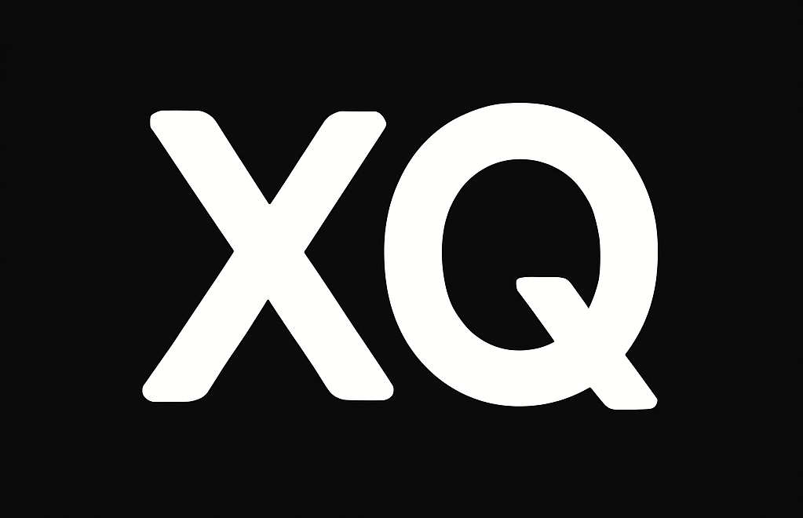
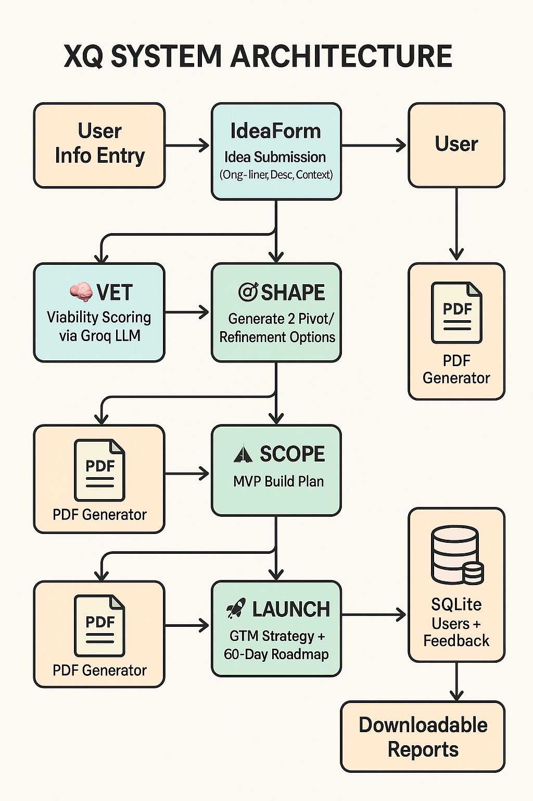

  

  
  
  

> **Showcase Only**  
> This repo demonstrates the architecture, UI, and outcomes of a working product.  
> The production code and pipelines are proprietary and available **under NDA**.  
> To request a demo: **akar@akar7a.onmicrosoft.com**
> **Tags:** `ocr` · `llm` · `google-vision` · `streamlit` · `AI OCR` · `ai-showcase`

# XQ – Human Judgment Layer Over AI Reports

## ⚡ 60-Second Summary

**XQ** is a brutal, honest startup idea evaluator.  
It adds a **human-like judgment layer** over AI outputs to guide founders with data-backed clarity — using a staged flow:  
**VET → SHAPE → SCOPE → LAUNCH**. Each step outputs a downloadable PDF for investors or advisors.

---

## ✅ What’s Inside (and what’s not)
- ✅ Project banner, videos, and architecture
- ✅ Sample input/output reports (PDF)
- ✅ Small, safe code sample + prompt logic
- ❌ No API keys, private prompts, or UI source
- ❌ No setup scripts or deployment guide

---

## Sample Videos
- [📼 VET Step — Feasibility Analysis](screenshots/vet.mp4)
- [📼 SCOPE Step — 30-Day MVP Plan](screenshots/scope.mp4)

## Sample Reports
- [🧾 VET Report (PDF)](samples/xq_vet_report.pdf)
- [🧾 SCOPE Report (PDF)](samples/xq_scope_report.pdf)

## Tech Stack

Python 3.10
Groq API (LLM)
ReportLab (PDF)
Streamlit (UI)
SQLite (Local DB)

Sample code in the "scripts" directory

## About Me

I’m Arindam Kar — fractional CTO and systems thinker with 23+ years in enterprise IT and AI delivery.  
I specialize in **PoC development**, **AI workflows**, and **LLM-backed automation** for startups and legacy modernization.

📧 **akar@akar7a.onmicrosoft.com**  
🔗 [LinkedIn: Arindam Kar](https://www.linkedin.com/in/arindam-kar-98085917/)  
🏢 [GitHub Org: KriyaLab](https://github.com/KriyaLab)
## Architecture

  

